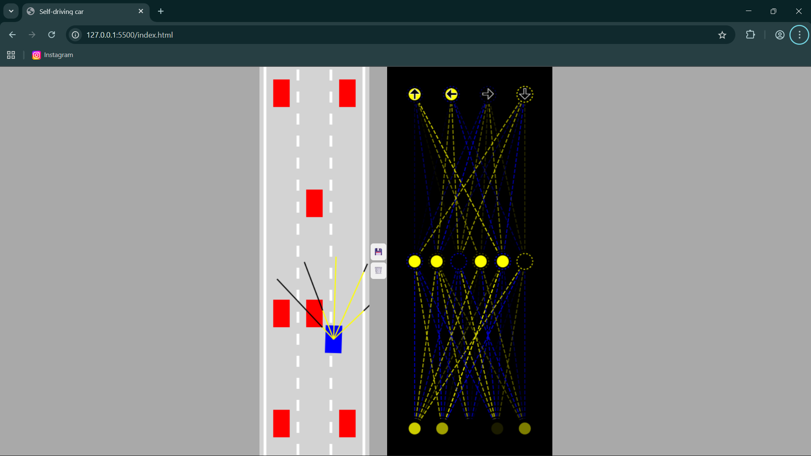

# 🚗 Self‑Driving Car Simulation

A browser-based self-driving car AI simulation built with JavaScript and HTML5 Canvas. The car navigates a road, detects obstacles using simulated ray sensors, and makes decisions via a visualized neural network.

---

## 🎬 Demo

Watch the simulation in action:


---

## 🖼 Screenshot



---

## 🧠 Project Overview

The simulation demonstrates how a basic neural network can control a self-driving car. Sensor rays feed data into the network, which then outputs steering commands. You can observe both the sensory inputs and the AI's decision-making process in real time.

---

## 📁 Project Structure

```
Self‑Driving‑Car‑/
├── assets/
│   ├── screenshot.png   # Static screenshot of the simulation
│   └── demo.mp4         # Video demonstration of the simulation
├── index.html           # Main HTML file
├── style.css            # Styles for layout and appearance
├── main.js              # Simulation orchestrator and loop
├── car.js               # Car class: physics, movement
├── controls.js          # Input handling and UI controls
├── sensor.js            # Simulated ray sensors logic
├── network.js           # Neural network logic
├── visualizer.js        # Neural network visualizer on canvas
├── road.js              # Road and obstacle generation
├── utils.js             # Utility functions/helpers
└── README.md            # This documentation file
```

---

## 🚀 How to Run It Locally

1. **Clone the repo**:

   ```bash
   git clone https://github.com/SantoshSingh1707/Self-Driving-Car-.git
   cd Self-Driving-Car-
   ```

2. **Launch the simulation**:

   Open `index.html` in your browser directly.

   Or use Live Server / static file server:

   ```bash
   npx serve
   ```

---

## ✨ Features

- **Custom Neural Network** — No external ML libraries. Weight matrices, activations, and feed-forward logic built from scratch.
- **Sensor Visualization** — Real-time render of simulated sensor rays.
- **Brain Saving/Clearing** — Save the best-performing AI (brain) in localStorage; reset with ease.
- **Interactive Controls** — Toggle AI behavior and watch as the simulation unfolds on the canvas.

---

## 🔮 Future Enhancements

- Introduce **genetic algorithms** to evolve performance over generations
- Add **dynamic obstacles**, `traffic signs`, `lane changes`, or **intersections**
- Implement **speed control**, **sensor customization**, or **variable road conditions**
- Create a **responsive UI** or deploy a **mobile-friendly version**

---

## 📄 License

This project is open source under the **Santosh Singh**. See the `LICENSE` file for details.

---

## 🙏 Acknowledgments

Inspired by JS-based AI demos and self-driving car visualizations; built to explore neural networks and autonomous decision making in the browser.
